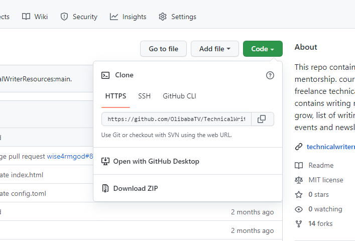
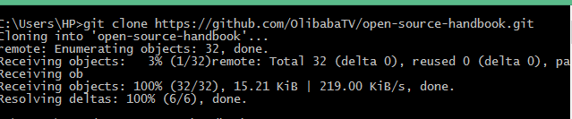
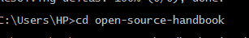
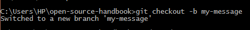
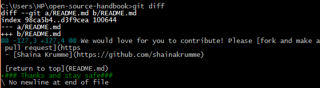

# **Introduction to GitHub**
1. ### **Introduction**
2. ###  **What is GitHub**
3. ### **Why GitHub**
4. ### **Git vs. GitHub**
5. ### **Clone (Show how to do cloning)**
6. ### **Pull request (Show how to do a pull request)**
7. ### **Commit (Show how to do a commit)**
8. ### **GitHub Desktop vs. Github CLI**
9. ### **Conclusion**


# **Introduction**

Github is an open source hosting platform for team project collaboration, software development, code hosting and version control using Git repository. This platform provides code project security control, code tracking, bug tracking,  task management, and project collaboration. This is a great tool for developers to leverage on and work on projects together irespective of their locations.This page will guide you through on some basics operations of github like fork repositories, push, branches, commits, clone and pull requests.  

# **What is GitHub**
GitHub is the largest open-source coding community on the internet powered by Git. GitHub is an online platform where users can upload code files, technical documentation, or articles in a repository for others to view and cause changes to the file. Users at different locations can collaborate and edit the uploaded files. While you upload your files on GitHub for various reasons, Git keeps track of any changes made in the file. Create your GitHub account by clicking the sign up link [Sign up here](http://www.GitHub.com/). 


# **Why GitHub**
GitHub code files or projects are collaborative. with GitHub, you can backup your files and share your code with collaborators. The platform is open source and manages tasks that allow multiple users to work remotely on a project code without compromising the project's integrity. 
 

# **Git vs GitHub**
Git is a version control system that allows users to keep track of changes made on code projects or documents. Git manages source code and stores different versions of code files during the editing process. 
GitHub is a web-based service that is primarily focused on centralized code hosting using Git Repository.
Let’s see some major differences between Git and GitHub.

|Git      | GitHub |
| ---      | ------- |
|Git is hosted locally   | GitHub is an online platform  |
| Git is a command line tool | GitHub is a Graphics User Intterface tool    |
| Git is powered by Linux    | GitHub is powered by Microsoft   |
|Git is a version control system  |    GitHub is a hosting platform for Git Repository
| Git is a software | GitHub is an open source platform

#  **How to do cloning**
Cloning allows users to copy the git repository from gitHub to their local system. 
These instructions will show you how to clone your Git Repository to your local terminal. 
1. From the Git repository, click on the Code button, select HTTPS and copy the repository URL
 
  

1. Launch and open your Git terminal  
2. type command syntax **git Clone** and paste the copied URL



# **How to do a pull request**
Pull requests works for collaboration, it inform collaborattors about changes made in a github repository. Once a pull request is done, collaborators can review the changes then decides to commit by merging into the base branch. 
Every project file is stored in a folder called repository; a repository contains all your project files, documents, and code. Before you do a pull request of a repository you will need to duplicate that repository called fork so you can make changes without affecting the original project file.

### 1. **Fork Respository** 
If you have identified the repository you are making changes to, you navigate to the upper right hand corner of the github repository and click on fork. Note, the fork request takes some time to duplicate your own copy of the repository.


### 2. **Clone the Repository** 


Once you are done with the fork request, you copy the reposittory URL, go to your git terminal and use the command syntaxt:
```
 git clone paste the copied url and enter
 ```
 

We have successfully cloned the repository to the terminal, now we will create a new directory for the cloned repository with the command syntax:
```
cd (Name of Directory)
```
 

### 3. **Create a branch** 
Creating a branch on a repository you are working on gives you a clear track of the changes you have made in the project. A branch name should be simple and clear. You can create a branch with the command syntax: 

```
git checkout -b [Branch Name]
```
 

### 4. **Edit your project** 
You can now make changes to your repository by typing command syntax **README.MD** in the terminal. 
Once you are done adding changes you save, view the changes in the terminal with command syntax **git diff** 

 

### 5. **Add changes to the branch** 
Since you have made your changes in the reposiotry you can now add it to the branch name you created with the command syntax:
```
$ git add . or git add Readme.md
```
 

# **Commit your changes**
This means saving the record or file that has been edited in the repository to your branch. You can achieve this with the command syntax: 
 ```
 git commit -m "my-message"
  ```
The command will request you enter your github username and password, once you provide the details correctly you can go ahead and push your changes to github.

### 1. **Push changes to GitHub**
Now that we are done making changes to the repository we can now push the it to gitbub, using the command syntax.
```
git push origin my-message
```

## **GitHub Desktop**

GitHub Desktop extends and simplifies your Git and GitHub workflow using a visual interface. According to [github,](https://docs.github.com/en/get-started/using-github/github-cli/) GitHub Desktop is an open source tool that enables you to be more productive. GitHub Desktop encourages you and your team to collaborate using best practices with Git and GitHub.

Just a few of the many things you can do with GitHub Desktop are:

- Add changes to your commit interactively
- Quickly add co-authors to your commit
- Checkout branches with pull requests and view CI statuses
- Compare changed images

## **GitHub CLI**

GitHub CLI is a command-line tool that brings pull requests, issues, GitHub Actions, and other GitHub features to your terminal, so you can do all your work in one place. GitHub CLI is an open source tool for using GitHub from your computer's command line. When you're working from the command line, you can use the GitHub CLI to save time and avoid switching context.

GitHub CLI includes GitHub features such as:

- View, create, clone, and fork repositories
- Create, close, edit, and view issues and pull requests
- Review, diff, and merge pull requests
- Run, view, and list workflows
- Create, list, view, and delete releases
- Create, edit, list, view, and delete gists
- List, create, delete, and connect to a codespace
For more information, see [GitHub CLI](https://docs.github.com/en/get-started/using-github/github-cli/)

# **Conclusion**

GitHub gives users collaborating feature to a project without interrupting the original file. Developers can contribute to projects, make code changes and submit the changes to the online repository. GitHub gives developers different versions of their code projects. Aside from working on your team project or private repository, users can contribute to open-source projects hosted by other developers on Github.
