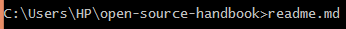

# **Introduction to GitHub**
1. ### **Introduction**
2. ###  **What is GitHub**
3. ### **Why GitHub**
4. ### **Git vs. GitHub**
5. ### **Clone (Show how to do cloning)**
6. ### **Pull request (Show how to do a pull request)**
7. ### **Commit (Show how to do a commit)**
8. ### **GitHub Desktop vs. Github CLI**
9. ### **Conclusion**


# **Introduction**
GitHub is an open-source hosting platform for team project collaboration, software development, and code hosting. The GitHub platform provides a lot of features, like code version control, code management, task management, and project collaboration. GitHub is a great online tool for developers to work on projects together irrespective of their locations. This article will guide you through some basic operations of GitHub, like forking repositories, pushing, branches, commits, cloning, and pulling requests.  

# **What is GitHub**
GitHub is an online platform where users upload code files, projects, and technical documentation in a repository for others to view and make changes to the files. Users at different locations can collaborate and edit the uploaded files. And while you upload your files on GitHub for various reasons, Git keeps track of any changes made to the file. You can Create your GitHub account by clicking on the link [Sign up here](http://www.GitHub.com/). 


# **Why GitHub**
There are various reasons people use GitHub, which include uploading projects, managing tasks, and team collaboration on code files. One exciting thing about GitHub is that it allows multiple users to work remotely on a project without compromising the project's integrity. With GitHub, you can back up your files and share your code with collaborators. 

# **Git vs GitHub**
Git is a version control system that allows users to keep track of changes made to code projects or documents. While Git manages source code and stores different versions of code files during the editing process, GitHub is an online platform where users upload projects for others to view, access, and contribute to the project. All the operations performed on GitHub are hosted using the Git Repository. Every project file is stored in a folder called a repository. A repository contains all your project files, documents, and code. 

This table shows some differences between Git and GitHub.

|Git      | GitHub |
| ---      | ------- |
|Git is hosted locally   | GitHub is an online platform  |
| Git is a command line tool | GitHub is a Graphics User Interface tool    |
| Git is powered by Linux    | GitHub is powered by Microsoft   |
|Git is a version control system  |    GitHub is a hosting platform for Git Repository
| Git is a software | GitHub is an open source platform

#  **How to do cloning**
Cloning allows users to copy the Git repository from GitHub to their local system. These instructions will show you how to clone your Git Repository to your local terminal using windows computer.
1. From the Git repository 
2. Click on the Code button 
3. Select HTTPS
4. Copy the repository URL
 
  

5. On the windows taskbar select the search icon and type **Git CMD**   
6. type syntax `git Clone [copied url] hit the enter key`

**Command**
```
git clone https://github.com/OlibabaTV/open-source-handbook.git
```


This process will have your Git repository cloned in your local Git CMD.

# **How to do a pull request**
Next, after cloning a repository, is how to perform a pull request. Pull requests work for collaboration; they inform collaborators about changes made in a GitHub repository. Before you do a pull request on a repository, you will need to duplicate that repository, called a fork, so you can make changes without affecting the original project file.

### 1. **Fork Respository** 
If you have identified the repository you are making changes to, you click on the fork tab and fork the respository.


 Note that the fork request takes some time to duplicate your copy of the repository.

### 2. **Clone the Repository** 

Once you are done with the fork request, you copy the repository URL using the cloning guide above, 
1. Open your **Git CMD** and paste the URL 

syntax
```
 git clone [copied url] hit the enter key
 ```
 **Command**
```
git clone https://github.com/OlibabaTV/open-source-handbook.git
```
 

now that you have successfully cloned the repository to the Git CMD, you will create a new folder for the cloned repository

with the syntax
```
cd (Name of Directory)
```
**Command**
```
cd open-source-handbook
```
 

### 3. **Create a branch** 
After creating a folder for the cloned repository, The next thing to do is to create a branch, creating a branch on a repository you are working on gives you a clear track of the changes you have made in the project. A branch name should be simple and clear. You can create a branch with the syntax 
```
git checkout -b [Branch Name]
```

**Command**
```
git checkout -b my-message
```
 

### 4. **Edit your project** 

After creating a branch name you can now make changes to your repository by typing the command

`README.MD` in the Git CMD.



This will open the repository readme file you want to work on. Once you are done adding changes to the repository you save and can view the changes made in the Git CMD with the command

```
 git diff
```
 

### 5. **Add changes to the branch** 

Since you have made changes in the reposiotry you can now add it to the branch name you created with the command

```
 git add.
```
 

Note that only changed and untracked files in the current directory will be added when you run git add.

# **Commit your changes**
This means saving the record that has been edited in the repository to your branch. You can achieve this with the command

 ```
git commit -m "my-message"
  ```
  
The command will request you to enter your github username and password, once you provide the details correctly you can go ahead and push your changes to github.

### 1. **Push changes to GitHub**

Now that you are done making changes to the repository you can now push to GitHub, using the command

```
git push origin my-message
```
The syntax will push your work to the GitHub repository, once your edit is considered okay, the project owner can commit the changes to the repository main branch.

## **GitHub Desktop** vs **GitHub CLI**

The GitHub Desktop makes use of user interface for better visuals when working on a repository. The GitHub Desktop is also an open source platform that makes users more productive during project collaboration.

The GitHub CLI makes use of command syntax to perform action like commit, create, clone and pull request on a repository.  
This table shows some differences between GitHub Desktop and GitCLI

|   | GitHub Desktop  | GitHub CLI  |      
|---|---|---|
| 1.  | create git repository, clone, add project etc with GU interface |  create repository, clone, and pull request with commands |     
| 2.  | The GUI interface makes collaboration more flexible| perform Reviews with commands  |     
| 3.  | Perform GitHub operations with GUI | Perform GitHub operations with command Line  |     


# **Conclusion**

GitHub gives users a collaboration feature for a project without interrupting the original file. Developers can contribute to projects, make code changes, and submit the changes to the online repository. GitHub gives developers different versions of their code projects. Users can contribute to open-source projects hosted by other developers on Github.
